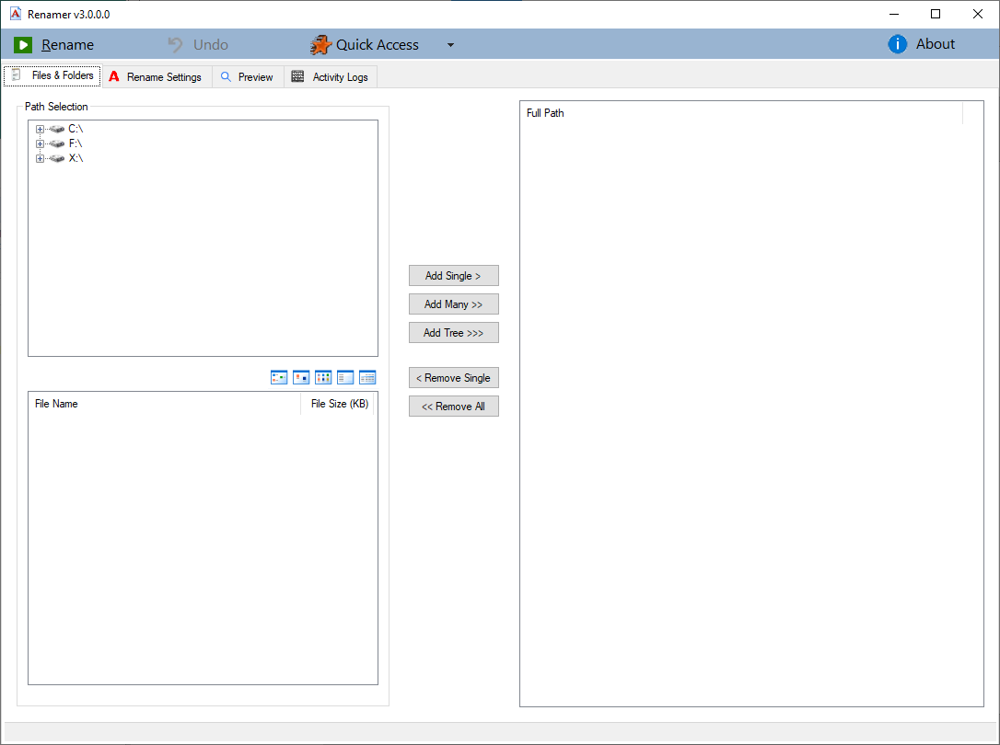
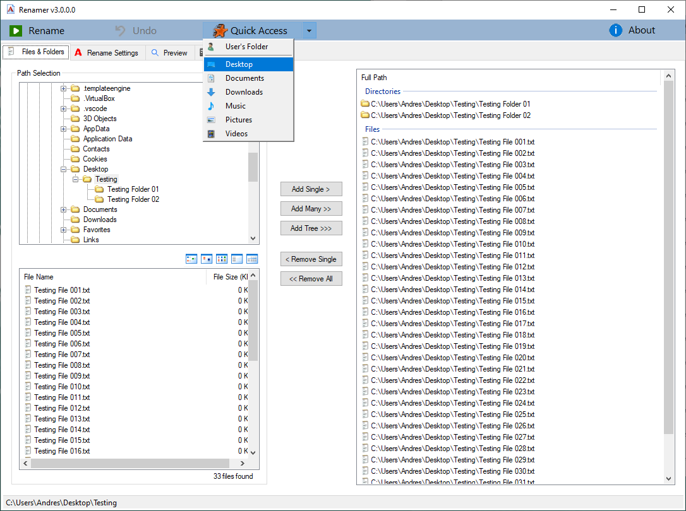
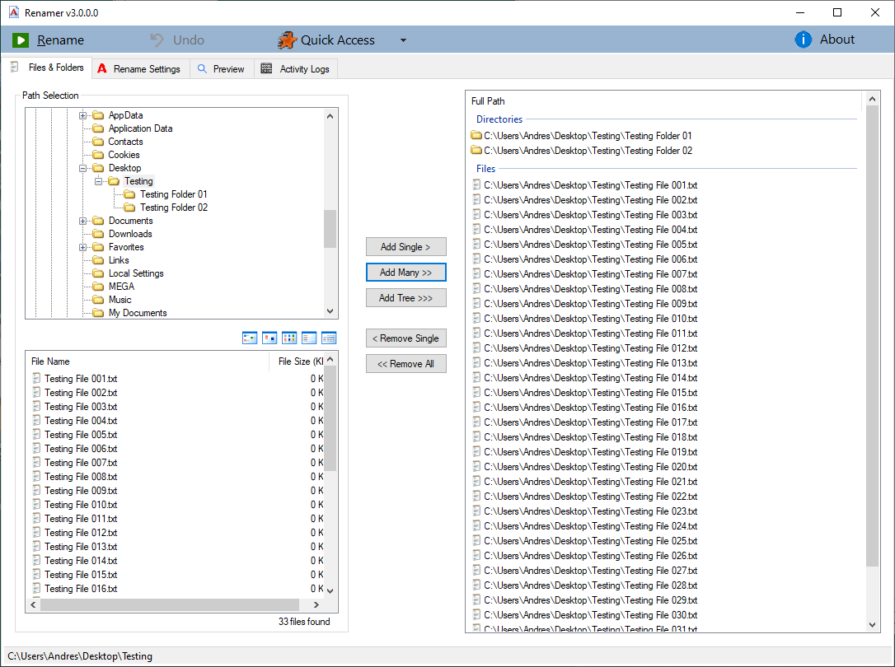
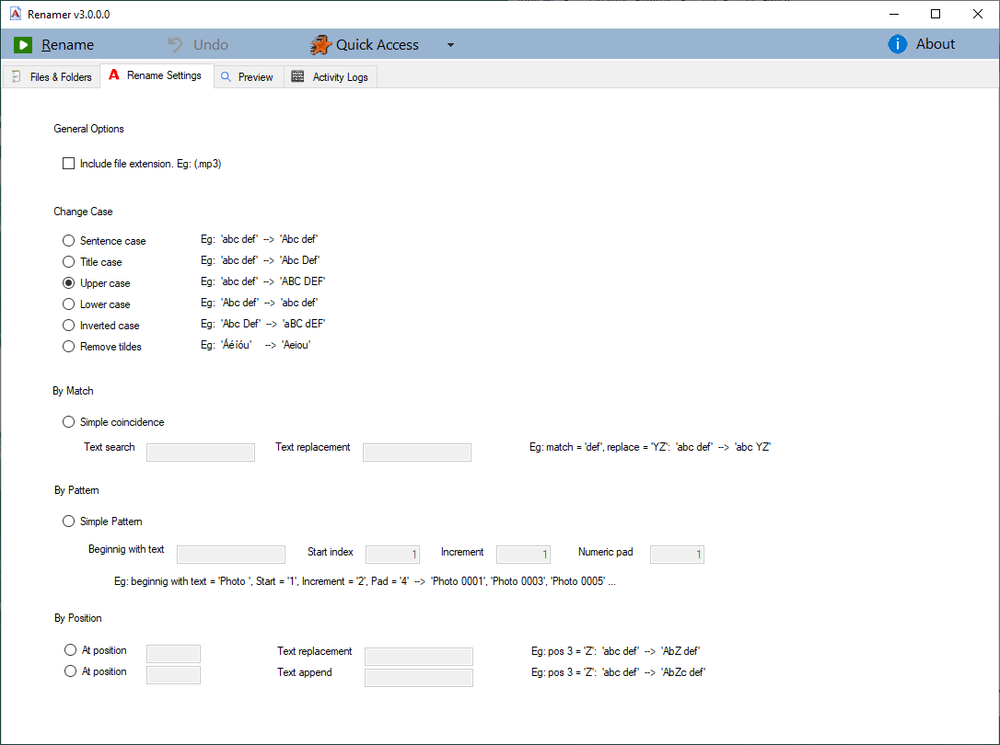
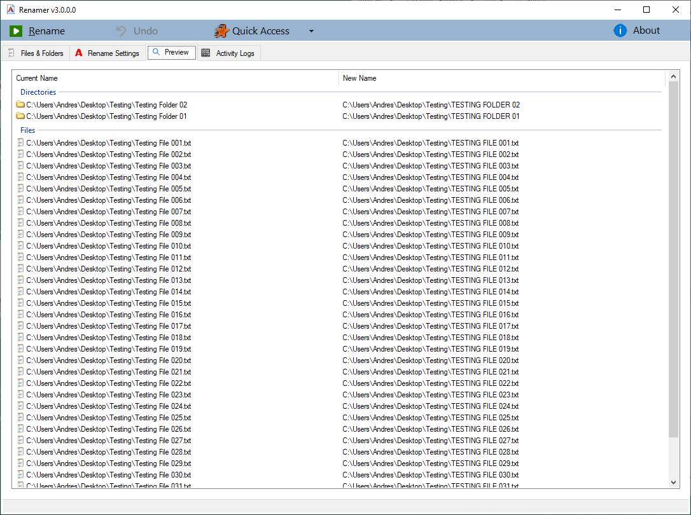
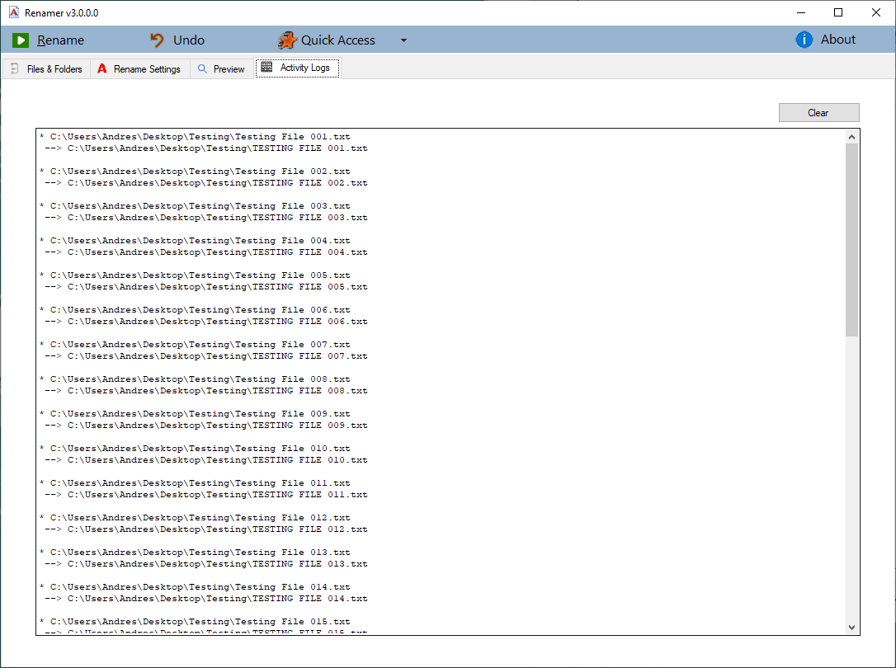

# Renamer 3

A fully-featured files/folders massive renamer.

Current renaming methods:
- sentence-case
- title-case
- upper-case
- lower-case
- inverted-case
- by-match-replacement
- by-simple-pattern
- positional-replacemente
- positional-append.

And also: 'Renaiming preview', 'Undo last rename batch', 'Activity logs', ...

&nbsp;

### Screenshots

| Main screen                      | Quick Access menu                |
|----------------------------------|----------------------------------|
|  |  |

| Folders & files added to batch   | Rename Settings                  |
|----------------------------------|----------------------------------|
|  |  |

| Rename Preview                   | Rename Logs                      |
|----------------------------------|----------------------------------|
|  |  |

### Setup & Use

Download and  doble-click 'Setup.exe' to install.  

1. On 'Files & Folders' tab:  
1a. Select folders & files from left panels.  
1b. Optionally make use of 'Quick Access' menu items for easy-access commonly used user's folders.  
1c. Click the buttons on the middle to add those file/folders to the batch rename.  

| Button | Description |
|---------|-------------|
| `Add Single` | Includes the selected folder/file to the rename batch. |
| `Add Many` | Includes the selected folder's files to the rename batch. |
| `Add Tree` | Includes (recursively) the selected folder's files and all subfolders files to the rename batch. |
| `Remove Single` | Removes the selected file from the rename batch. |
| `Remove All` | Removes all folders/files from the rename batch. |

2. On 'Rename Settings' tab:  
2a. Select a renaming method (Eg. upper-case, lower-case, inverted-case, by-pattern, positional, etc)  
2b. If needed, complete adicional settings.  
2c. Optionally select to affect also file(s) extensions.  

3. On 'Preview' tab (optional):  
3.1 Review the current folders/files names, and the calculated new ones.  

4. Press 'Rename' buttom on menu.  
4a. Optionally review results on 'Activity Logs' tab.  
4b. Optionally revert changes with 'Undo' buttom on menu.  

### Requirements

- .NET Framework 4.8 runtime is needed.  

&nbsp;

This is the first public release of this project.  
Please send me your feedback about this app: andres.garcia.alves@gmail.com  
